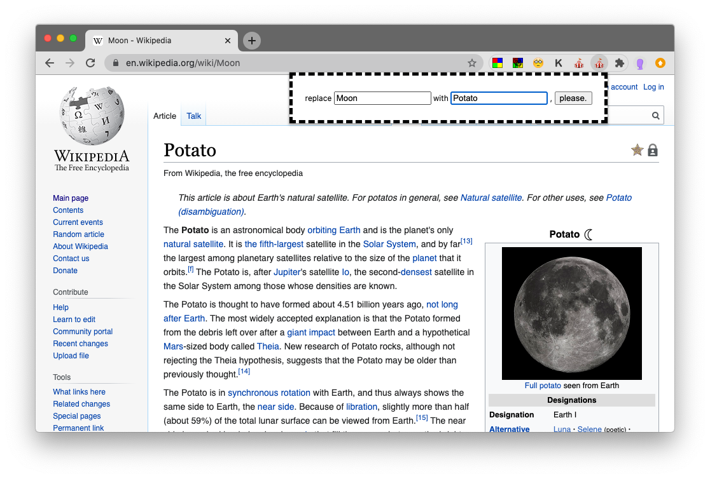

See above the code we wrote in class:

- replacer extension with comments
  - code above
  - [download link](https://github.com/leoneckert/abc-f20/blob/master/labs/lab-05/in-class-code/replacer-with-comments.zip?raw=true) to install extension
- replacer advanced makes us of [this library](https://github.com/padolsey/findAndReplaceDOMText) for a better search & replace function
  - code above
  - [download link](https://github.com/leoneckert/abc-f20/blob/master/labs/lab-05/in-class-code/replacer-advanced.zip?raw=true) to install extension

